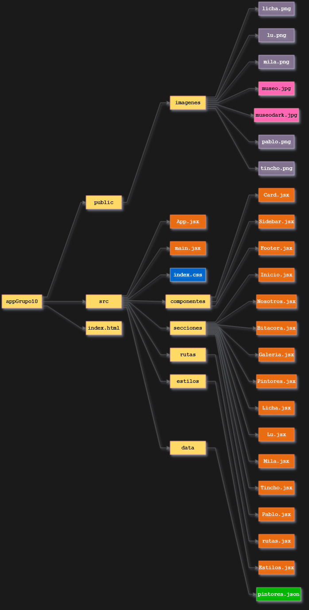

# 🎨 Museo Grupazo - Single Page Application

Una aplicación React moderna que presenta un museo virtual de artistas y obras de arte, desarrollada colaborativamente por el Grupo 10 como trabajo práctico de la tecnicatura.

## 🎯 Descripción del Proyecto

**Museo Grupazo** es una SPA (Single Page Application) que permite explorar información sobre artistas famosos y sus obras maestras. El proyecto integra datos locales en JSON, consumo de APIs públicas, y un diseño moderno con tema claro/oscuro.

### Características principales

- Galería de artistas del equipo
- Integración con API del Metropolitan Museum
- Datos locales en JSON con artistas famosos
- Tema claro/oscuro personalizable
- Diseño completamente responsivo
- Navegación SPA sin recargas de página

## 📁 Estructura del Proyecto

```
/
├── src/
│ ├── componentes/ # Componentes reutilizables ("piezas de Lego" de la UI)
│ │ ├── Card.jsx
│ │ ├── Sidebar.jsx
│ │ └── Footer.jsx
│ ├── secciones/ # Componentes que actúan como páginas o vistas principales
│ │ ├── Inicio.jsx
│ │ ├── Nosotros.jsx
│ │ ├── Bitacora.jsx
│ │ ├── Galeria.jsx
│ │ ├── Pintores.jsx
│ │ └── [integrantes] # Licha.jsx, Lu.jsx, Mila.jsx, Tincho.jsx, Pablo.jsx
│ ├── rutas/
│ │ └── rutas.jsx # Configuración centralizada de React Router
│ ├── estilos/
│ │ └── Estilos.jsx # Lógica para los temas (light/dark) con Styled Components
│ ├── data/
│ │ └── pintores.json # Datos locales consumidos por la aplicación
│ ├── App.jsx # Componente raíz que organiza el layout principal de la aplicación
│ ├── main.jsx # Punto de entrada de JavaScript, donde React se monta en el DOM
│ └── index.css # Estilos globales y reseteos de CSS
├── public/
│ └── imagenes/ # Contiene todos los assets estáticos como imágenes y logos
└── index.html # El "cascarón" donde se inyecta toda la SPA (Single Page Application)
```

## 🚀 Tecnologías Utilizadas

```json
{
  "frontend": ["React", "React Router", "Styled Components"],
  "http": "Axios",
  "deployment": "Vercel",
  "versionControl": "GitHub",
  "apis": ["Metropolitan Museum Collection API"]
}
```

⚙️ JavaScript / Funcionalidades Dinámicas

| Sección                       | Componente / Archivo                 | Funcionalidad                                           |
| ----------------------------- | ------------------------------------ | ------------------------------------------------------- |
| **Home**                      | `Home.jsx`                           | Renderiza introducción del museo y tarjetas principales |
| **Galería**                   | `Gallery.jsx`                        | Muestra obras obtenidas desde JSON o API externa        |
| **Detalle de Obra / Artista** | `CardIntegrante.jsx` / `Artista.jsx` | Render dinámico con props o datos del JSON              |
| **API Pública**               | `ApiMetMuseum.jsx`                   | Consumo de API del Met Museum usando **Axios**          |
| **Tema claro/oscuro**         | `ThemeContext.jsx` + `Botón de tema` | Alterna dinámicamente entre temas mediante Context      |
| **Sidebar y Navegación**      | `Sidebar.jsx`                        | Controla rutas, animaciones y estados de expansión      |
| **Responsividad**             | CSS + styled-components              | Cambia disposición según el tamaño de pantalla          |

## 📱 Responsividad

El proyecto implementa 3 puntos de quiebre:

| Mobile | < 400px |
| Tablet | 400px - 800px |
| Desktop | > 800px |

## 🔧 Instalación y Uso

### Requisitos previos

- Node.js (v14+)
- npm o yarn

### Pasos de instalación

```bash
# Clonar el repositorio
git clone https://github.com/[usuario]/museo-grupazo.git
cd museo-grupazo

# Instalar dependencias
npm install

# Iniciar servidor de desarrollo
npm run dev

# Build para producción
npm run build

# Preview de build
npm run preview
```

## 🌐 Deploy

La aplicación está deployada en **Vercel** y es accesible públicamente en:

https://react-g10.vercel.app/

## 🤝 Equipo de Desarrollo

| Licha | Frontend / Hardware
| Lu | Frontend
| Mila | Frontend / QA |
| Pablo | Lead Developer |
| Tincho | Full Stack |

## 📝 Licencia

Este proyecto es parte de un trabajo académico. Todos los derechos reservados © 2025 Grupazo.

## 🚀 Mejoras Futuras

Este archivo se actualizará en el próximo trabajo práctico (TP3), incorporando:

- [ ] Paginación en galería
- [ ] Filtros avanzados
- [ ] Formulario de contacto
- [ ] Más integraciones de APIs
- [ ] Animaciones mejoradas
- [ ] Soporte multiidioma


## 🗂️ Estructura del Proyecto

A continuación se muestra el diagrama del proyecto:


